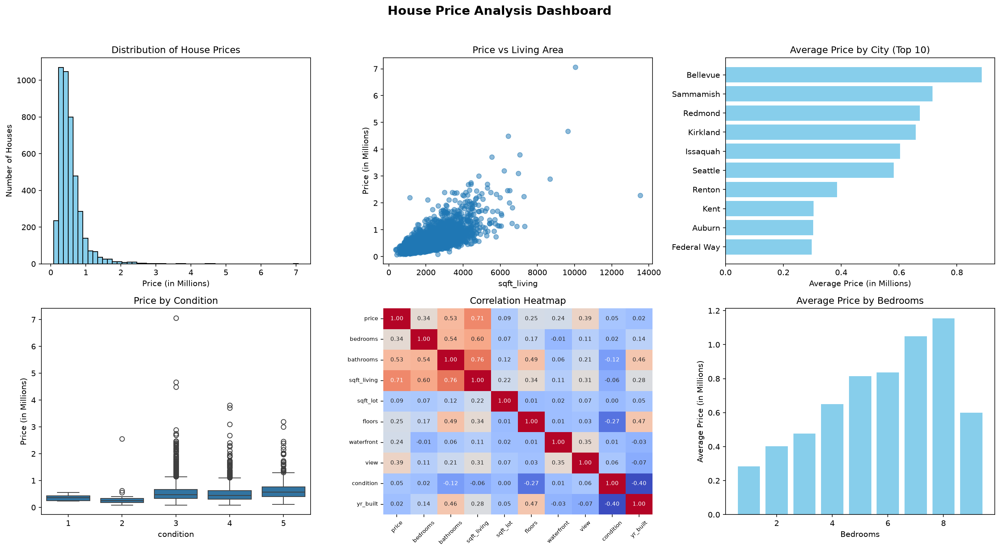

# 🏠 House Price Prediction

## 📌 Question
What factors influence house prices, and can we build a model to 
predict a house's price based on its features (area, bedrooms, 
bathrooms, location, etc.)?

## 📁 Dataset Overview
- Data sourced from Kaggle: [House Price Prediction](https://www.kaggle.com/datasets/shree1992/housedata) by shree1992
- Originally provided as a nested JSON file (`data.dat`), containing 
  4,601 house records
- Key fields: price, bedrooms, bathrooms, sqft_living, sqft_lot, 
  floors, waterfront, view, condition, yr_built, yr_renovated, address
- Some fields required parsing/flattening before use (nested area 
  data, text-encoded room counts)

## 📖 Column Reference

| Column | Meaning |
|---|---|
| `price` | Sale price of the house |
| `bedrooms` | Number of bedrooms |
| `bathrooms` | Number of bathrooms (0.5 = half bathroom, no shower/tub) |
| `sqft_living` | Size of living area in square feet |
| `sqft_lot` | Size of the lot in square feet |
| `sqft_above` | Square footage of the house apart from the basement |
| `sqft_basement` | Square footage of the basement |
| `floors` | Number of floors |
| `waterfront` | 1 = has waterfront view, 0 = does not |
| `view` | 0–4 rating of how good the property's view is (0 = none, 4 = excellent) |
| `condition` | 1–5 rating of the house's overall condition (1 = poor, 5 = very good) |
| `yr_built` | Year the house was originally built |
| `yr_renovated` | Year of last renovation (NaN/0 = never renovated) |
| `date` | Date the house was sold |
| `address` | Property address |

## 🧹 Data Cleaning
- Parsed raw JSON structure into a clean, flat DataFrame
- Extracted `bedrooms` and `bathrooms` from an embedded text string
- Split combined `sqft_living`/`sqft_lot` values into separate 
  numeric columns
- Dropped `yr_renovated`: most values were missing and it was impossible to tell "never renovated" from "value not recorded"
- Converted date fields to proper datetime format
- Kept only city for address column.
- Removed rows with price = 0,bedrooms = 0, bathrooms = 0 and 2 extreme price outliers inconsistent with house size.
- Recalculated `sqft_living` as `sqft_above + sqft_basement` to fix 2 rows where the originally parsed value was inconsistent with its 
  components and dropped `sqft_above, sqft_basement`.

## ✅ Data Quality

**Issues found in the raw data:**
- Nested JSON structure — `area` field contained a dictionary instead 
  of flat columns
- Text-encoded values — `rooms` field combined bedrooms and bathrooms 
  into a single string, with inconsistent word order across rows
- 248 rows had `price = 0`, an invalid placeholder value
- 2 extreme price outliers inconsistent with house size/features
- 2 rows had `sqft_living` that didn't match `sqft_above + sqft_basement`
- `yr_renovated` was missing for the vast majority of rows, and it was 
  not possible to reliably distinguish "never renovated" from "value 
  not recorded" — the column (and a derived flag) was dropped entirely
- `date` stored as a non-standard string format (`20140502T000000`)
- 1 duplicate row

**After cleaning:**
- No missing values remain in any retained column
- No duplicate rows
- All columns have correct, consistent data types (numeric fields as 
  int/float, dates as datetime)
- `sqft_living` recalculated as `sqft_above + sqft_basement` to 
  guarantee internal consistency
- Final dataset: 4,345 rows × 14 columns

## 📈 Charts

## 🔑 Key Findings

- House prices are right-skewed — most houses fall between roughly 
  200,000–800,000, with a long tail of expensive outliers reaching up 
  to 7,062,500. The median (471,000) is a more reliable "typical price" 
  than the mean (556,052), which is pulled upward by a few very 
  expensive houses
- **`sqft_living` is the strongest predictor of price** (correlation 
  0.71) — larger living area reliably means a higher price, though one 
  clear outlier (a ~10,000 sqft house at 7,062,500) sits well above 
  the general trend
- **Location has a major effect on price** — Bellevue has the highest 
  average price (~880,000) among the top 10 cities by volume, while 
  Federal Way, Auburn, and Kent are the most affordable (~300,000), 
  nearly a 3x gap
- **Bedrooms show a fairly steady upward trend with price** up to 7 
  bedrooms, but drop off at 8 — likely due to very few houses having 
  that many bedrooms rather than a real pricing pattern
- **Condition has almost no effect on price** (correlation only 0.05) 
  — a genuinely counter-intuitive finding. Condition 3, 4, and 5 show 
  very similar price ranges, and even condition 1 (worst) isn't 
  noticeably cheaper
- **`yr_built` also barely matters** (correlation 0.02) — how old or 
  new a house is doesn't meaningfully predict its price in this dataset
- Other useful predictors from the correlation heatmap: `bathrooms` 
  (0.53), `view` (0.39), `bedrooms` (0.34) — all moderately linked to 
  price
- Some features are correlated with each other, not just with price — 
  e.g., `bathrooms` and `sqft_living` (0.76) — meaning these features 
  carry overlapping information rather than fully independent signals

## 🤖 Price Predictor (Machine Learning)
Built a **Linear Regression** model to predict house price based on 
features such as area, bedrooms, bathrooms, and location.

## 💡 Recommendations

- `sqft_living` is the single strongest driver of price — any pricing 
  or valuation tool should weight living area heavily
- City/location should be a primary factor in pricing decisions, given 
  the ~3x gap between the cheapest and most expensive cities in this 
  dataset
- `condition` and `yr_built` had minimal impact on price here — pricing 
  strategies shouldn't over-rely on these without further investigation 
  into why (e.g., renovations may have offset age in older homes)
- Waterfront and view ratings meaningfully increase price and should be 
  factored into premium pricing for qualifying properties

## 🎯 Conclusion

This project cleaned a genuinely messy, nested JSON housing dataset 
into a usable format, explored it to uncover real patterns (strong 
price-size relationship, weak price-condition relationship, significant 
city-based price differences), and built a Linear Regression model that 
explains 68% of the variation in house prices (R² = 0.68).

Along the way, two potential improvements were tested — removing 
extreme outliers and dropping weak features (`condition`, `yr_built`, 
`sqft_lot`) — but neither improved performance on this dataset, so the 
final model retains the full feature set and all data points. While 
not a perfect predictor, the model performs reasonably well given the 
available features, and this project demonstrates a complete, honest 
data science workflow — testing hypotheses against evidence rather than 
assuming textbook improvements will always apply.

## 🛠️ Tech Used
Python, Pandas, NumPy, Matplotlib, Seaborn, Scikit-learn